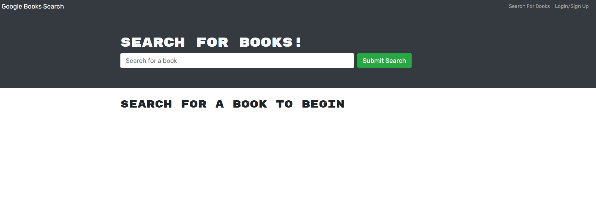
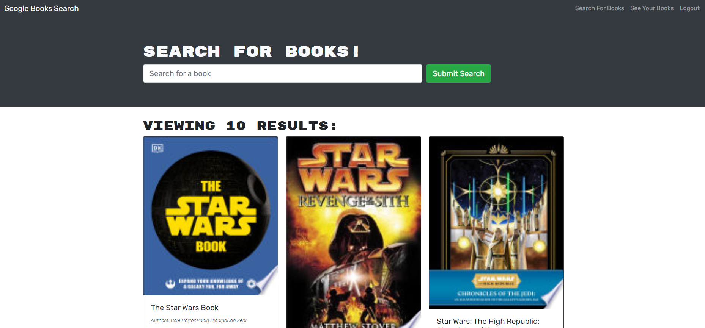
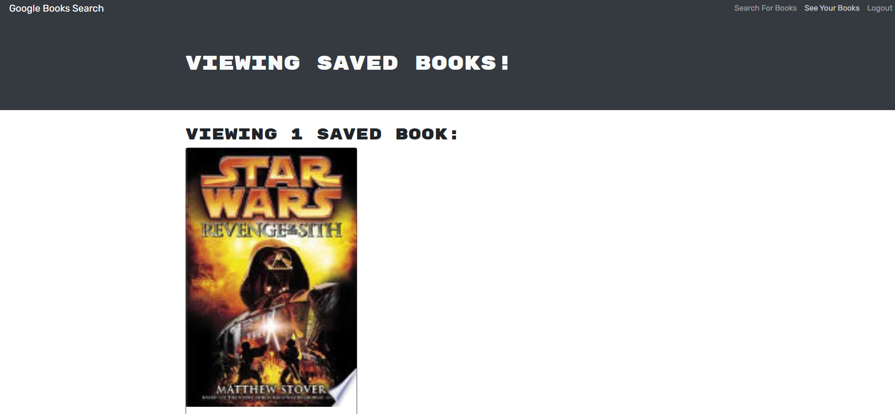

# Book Search Engine

## Description
The Book Search Engine is a web application that allows users to search for books using the Google Books API. Users can sign up or log in to save their favorite books and remove them from their saved list. The application is built using the MERN stack (MongoDB, Express.js, React, Node.js) and utilizes GraphQL queries and mutations to fetch and modify data.

# Table of Contents
- User Stories
- cceptance Criteria
- Technologies Used
- Installation
- Usage
- Deployment
- Screenshots
- Contributing

# User Stories
As an avid reader, I want to search for new books to read so that I can keep a list of books to purchase.

# Acceptance Criteria
Given a book search engine:

When I load the search engine, then I am presented with a menu with the options Search for Books and Login/Signup and an input field to search for books and a submit button.
When I click on the Search for Books menu option, then I am presented with an input field to search for books and a submit button.
When I am not logged in and enter a search term in the input field and click the submit button, then I am presented with several search results, each featuring a book’s title, author, description, image, and a link to that book on the Google Books site.
When I click on the Login/Signup menu option, then a modal appears on the screen with a toggle between the option to log in or sign up.
When the toggle is set to Signup, then I am presented with three inputs for a username, an email address, and a password, and a signup button.
When the toggle is set to Login, then I am presented with two inputs for an email address and a password and login button.
When I enter a valid email address and create a password and click on the signup button, then my user account is created, and I am logged in to the site.
When I enter my account’s email address and password and click on the login button, then the modal closes, and I am logged in to the site.
When I am logged in to the site, then the menu options change to Search for Books, an option to see my saved books, and Logout.
When I am logged in and enter a search term in the input field and click the submit button, then I am presented with several search results, each featuring a book’s title, author, description, image, and a link to that book on the Google Books site and a button to save a book to my account.
When I click on the Save button on a book, then that book’s information is saved to my account.
When I click on the option to see my saved books, then I am presented with all of the books I have saved to my account, each featuring the book’s title, author, description, image, and a link to that book on the Google Books site and a button to remove a book from my account.
When I click on the Remove button on a book, then that book is deleted from my saved books list.
When I click on the Logout button, then I am logged out of the site and presented with a menu with the options Search for Books and Login/Signup and an input field to search for books and a submit button.

# Technologies Used
- MongoDB
- Express.js
- React
- Node.js
- GraphQL
- Apollo Server
- Apollo Client
- JWT Authentication

# Installation
To run this application locally, you'll need Node.js and MongoDB installed on your machine.

1. Clone this repository:
<code>git clone https://github.com/your-username/book-search-engine.git</code>

2. Navigate to the project directory:
<code>cd book-search-engine</code>

3. Install dependencies:
<code>npm install</code>

4. Start the server:
<code>npm start</code>

5. Open your browser and go to http://localhost:3000 to view the application.

# Usage
- Sign up or log in to your account.
- Use the search bar to search for books.
- Click on a book to view details and save it to your account.
- View your saved books by clicking on the "My Books" option.
- Remove books from your saved list by clicking on the "Remove" button.

# Deployment
This application is deployed on Render. You can access it here.

# Screenshots

